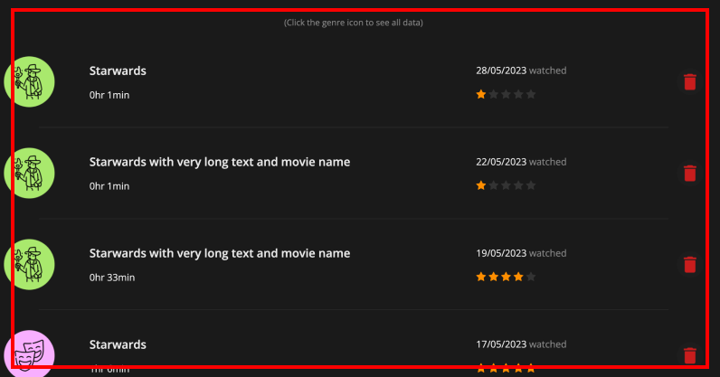

# Application configuration

## Main files

Below are the files that are in the public folder for structuring the website:

- index.html: A single page structure file used for presenting the context of the website
- style.css: A stylesheet that controls the styling of the whole webpage
- script.js: A javascript that works as an input manager to responses users' input

<br>

## Other folders

- image: A folder that stored all images to present within the website

<br>

# Deployment procedures

Please use **index.html** as the entry point of the website. Additionally, this website was designed to best fit the experience of a screen with a 1920x948 ratio. Besides, it was also responsible for other screen sizes listed on [ScreenSiz website](https://screensiz.es/), including tablet (768x900) and mobile (414x896). However, some functions may be limited for mobile, e.g. hovering. Thus, it is recommended to use a desktop to view this website for the best experience.

The only installed package was the node server. It was used for hosting the website locally. To start running the website, please use the command "npm run start" and enter the URL of "http://localhost:8888/" on any web browser (recommend Google / Brave browser). 

Besides, in the development process, ["Live Server"](https://github.com/ritwickdey/vscode-live-server-plus-plus) extension from VS code was preferred and utilized for an efficient and easier testing purpose.

<br>

# Development documentation

## Section 1: Justifications for implementation decisions

### **Overall**:

- **Title tag**: I have added a title icon for the website using the logo. This helps users to recognise the website. The title tag "Movience - Movie Experience Tracker" also helps the users to understand what this website is for and may provide them with a first impression of the contents to be expected from the website. This helps to rank higher in the search results (SEO) and was supported by Google (2022) that the title query should be related to users' needs and the product the website is showing.


<br>

- **Flexbox & Grid layout**: Flexbox and grid layout were used across the whole website. They help to better organise the section, and form a neat and clean design that can easily be adjusted to form a responsive design. Also, I can align the content within the layout easily to form an aesthetic pattern that increases readability.

```
// Examples from style.css file
.movie-details {
    display: grid;
    grid-template-columns: 65% 30%;
    justify-content: space-between;
    align-items: center;
}
```

<br>

### **Navigation bar**:

- **Section highlight**: The navigation bar was added to provide an efficient way for the users to jump to different sections within the website. This saves their time from scrolling. According to UI Patterns (n.d.), it offers a clear and identical visual indication of what content can be found on the website. Providing an alternative way for the users to view different sessions, including an easy way to back to the landing section, helps to achieve a higher SEO ranking score. Besides, I used an orange underline to indicate which section the users are in. This tackles one of the heuristic issues, which is "recognition rather than recall”. Users do not have to memorise that, instead, it was visualised (Nielsen, 1994). The session that users are hovering over will be shown with a different text colour. This enables the users to notify the differences between the section they are at and the section they are hovering.


<br>

### **Landing section**:

- **Featured image**: Featured image is a design pattern that can create an emotional connection with visitors, and focus the user’s entire attention on it (Babich, 2019). As the main theme of the website is "movie", showing a movie-related feature image is the fastest way to communicate it. This also provides a memorable experience and first impression for the users. 


<br>

### **Movie input form section**:

- **Input feedback**: The input form fields were set to required. Thus, when users have any empty field upon submission, they will be notified. Besides, once the user submitted the movie form, they will be redirected to the history session with the updated list. This lets the users know that their submission has been recorded (UI Patterns, n.d.).

<br>

- **Input prompt**: Labels were added to the input fields, this helps to further explain what kind of input is needed for that field (UI Patterns, n.d.). Additionally, when the users have filled in the correct data type within the field, the labels will be moved to the upper part of the field to avoid blocking the view of the elements. At the same time, the users can still see the prompt to double check they are entering the correct data in each field.

<br>

- **Structured format**: A further step for the input prompt design pattern was to validate users' input with the structured format. The required input data types were set with care. Thus, the validation helps to guide the users on what to fill. For instance, a calendar picker for watched date and number input for the movie duration. Also, the structured format guides users to fill in the objective information (e.g. movie name) first and other subjective information afterwards. This ordering set clear expectations for the users (UI Patterns, n.d.).


<br>

- **Calender picker**: As mentioned the calender picker was used for the date input type. This design pattern allows users to easily choose their watched date. It was also limited to today's date to avoid users accidentally selecting a future date. This error prevention meets the requirement of the heuristic groups and improves the usability of the website.


<br>

- **Symbolic representation**: I used star symbols in the rating input of the movie form session. This creates external consistency, as users should have a common sense of it as the representation of scores. This increases learnability and usability (NNgroup, 2019). Additionally, using the star symbols instead of plain number text also improves the aesthetic of the design, as well as engagement.


<br>

### **Watched history section**:

- **Sorting dropdown**: A sorting dropdown menu was utilised for the users to reorder their watched history list. This design pattern allows users to compare the movie data based on different attributes easily. The pattern provides an easy way to organize the data as well (UI Patterns, n.d.). Users can search for movies with specific ratings or genres easily, which increases the efficiency of the design.


<br>

- **Vertical scroll group**: The movie history section was designed to be an individual scrolling section. Without the need of clicking any button to expand the list. This increases accessibility and usability as they can access the content with less effort and in a clear manner (Smith, n.d.). Especially vertical scrolling is easier than horizontal scrolling for desktop users with the standard mouse (Juviler, 2021). Thus, desktop users can use the middle wheel button to scroll and read through their watched history.



<br>

### **Profile section**:

- **Z-shape pattern**: I applied a Z-shape pattern to the profile section design. As users normally read from the top left to the bottom right. This provides a clear navigation flow that improves the user experience (Babich, 2017). This design pattern also helps to explain the data narrative smoothly. Users will be prompted to understand their overall watch time first, then move to their favourite movie genre and the details of the genre. Finally, some recommended movies are based on their favour.


<br>

## Section 2: Comparisons between mockups and prototype

### **Overall**:

Compared to the mockups, the prototype was designed to be functional. Interactions and SEO were further considered when developing the prototype. As it is important to have a user-friendly experience for all users, I tried to make the website more accessible to have a better SEO score. A group of target users had tested the mock-up as well (see section 3), and they did not find any issue with it. Thus, in general, the structure and format of the website were mostly the same as the mock-up. However, there were still some design adjustments being made after applying their feedback from other iterations.

<br>

### **Navigation bar**:

First of all, a minor change for the navigation bar was the text content. As suggested by the tutor, I should make access to the "Movie Form" session easier to increase the efficiency of completing the task from anywhere on the website. This is important for the accessibility of the website as well. A popup bubble may help to solve this issue. However, to avoid the popup blocking other elements on the screen and ensure the functions are not repetitive. I decided to refine the navigation bar to make the access more obvious and accessible. I added a "+" icon next to the "New Movie" text, this helps to notify the users that this session is about adding new movies, and meanwhile maintaining the aesthetic part.

<br>

### **Movie input form section**:

<br>


The design pattern of the input prompt was refined. The input labels are placed inside the input fields when the users have not entered anything yet. They will move to the top of the fields and change to a highlight colour once there are valid inputs within. Compared to the mock-up stage, this design provides a better usability experience as it tackles the heuristic violation of visibility of system status.

<br>

Although the data types were considered during the mock-up stage, it was not carefully crafted for the best user experience. For instance, the dropdown menu for the genre input. It limits the user's selections from picking a genre that was not specified. This reduces the effectiveness of the design. Thus, in the prototype stage, I changed it to a text input field but utilised the dropdown and search function idea to provide suggestions to the users. Also, the date input format was added in the prototype, which helps to ensure consistent date format input.

<br>

### **Watched history section**:

<br>


In the section, I removed the "show all" button from the mock-up design. Instead, I replaced it with a vertical overflow scrolling group. This reduces the trouble of using the function. For instance, after expanding the list and users are at the bottom of it, it requires a lot of scrolling to get back to the top and click to hide again. This was not considered at the mock-up stage. However, with the new design, it avoids the long list of movies adding to the website's length. Users can view all movies directly within the frame, and they can still easily scroll to other sections of the page.

<br>

Additionally, to make the searching process of the movie history easier, I added a sort function. This allows users to sort the order of the list with different preferences. A remove all button was introduced as well to avoid the number of clicks that are required to clean the watched history. This provides better user control and freedom (one of the 10 usability heuristics) to remove their history. Furthermore, a confirmation popup is added to address the error prevention usability problem. This ensures users won't remove all their watched history due to accidentally pressing the button.

```
// Function that sorts the data in ascending order based on specific criteria
function sortOrderA(a, b) {
    if (a.sortCriteria < b.sortCriteria) return 1;
    if (a.sortCriteria > b.sortCriteria) return -1;
    return 0;
}
```

<br>

Besides, an instruction text was added to notify users that they can click the movie genre icon to expand and view all its associated details. This improves the experience of a new user and increases the learnability of the website.

<br>

### **Profile section**:

<br>


The only changes made to the profile section was the chart type of users watched the time of different genres. Based on the feedback from A2, a pie chart may not be the best option to display and compare the difference between user-watched times. Thus, I replaced it with a horizontal bar chart, which shows the watched time and is arranged in descending order to show the movie genre that users watched most.

<br>

## Section 3: Discussion of any further iterations

The prototype development was started before receiving the feedback from assignment 2. Three rounds of usability tests were conducted with 4 participants from the target user group (active streamer). The participants were aged from 16 to 49, and they usually watched movies more than two hours a day. 

As it is a dynamic website, I was unable to deploy it to the GitHub server to conduct testing sessions with other users remotely. Thus, three iterations were conducted instead to get a deeper understanding of the usability issues.

<br>

### **1st iteration**:

The first iteration test was carried out using the same mock-up I submitted for A2. It is because I want to ensure the story of the website is appealing to my target audience before starting the development. Especially when the feedback from assignment 2 is going to be more about the general usability issues, instead of some particular issues that only the target users can find. Finding usability problems in the early stage of production helps to avoid a lot of rework. 

Besides, the participants were satisfied with the overall design and they agreed that the details to fill in the form are enough and are not too many. They also highlighted that the dark colour theme suits the design, especially when streaming platforms nowadays are using dark themes as well. However, the limit of this iteration is clear. The prototype interaction was incomplete. Thus, its potential problems may not be tested with this session.

<br>

### **2nd iteration**:

As a result, I started prototyping the website structure and its functionality once gathering all their feedback. This ensures that I can get an extra round of usability testing. The second iteration was conducted after completing all the features of the website. Then, the same group of users are asked to install the whole folder on their computer and test it for 3 days. They were asked to enter the previous 7 days' records before starting the testing. 

The feedback from this iteration is more valid than the first one. This is because the users are actually using the website and directly providing their personal experience of using the website. Their feedback and experience were noted every day. The users are having different screen sizes. Although they did not experience impactful challenges due to that, I started adding responsive design to the website once I noticed that. Most of the website is refined to be responsive, which creates a better testing experience for the participants.

A lot of helpful suggestions from the tutor were received before the 2nd iteration, and more design patterns were added compared to the mockup. These functions were tested as well, to understand whether their experience was improved or not. One of the participants revealed that the sorting function is handy and easy to use. They also find the recommendation movie section interesting which changes based on their data input. They also suggested that it will be nice to allow them to click on those movies to view their details. However, this is currently out of the scope and due to the time constraint, it was not added to the final design. 

After the end of this iteration, the participants were asked to fill out a SUS questionnaire. The result was satisfactory with an average score of 82, which is classified as "excellent usability".

<br>

### **3rd iteration**:

Only minor refinements were done after the 2nd iteration to better fit into the design and assessment brief. Also, the assignment 2 feedback was applied to further strengthen the design. Adding new movies is one of the key functions of the website. The feedback suggested that to create a popup bubble for easier navigation. Some users mentioned that they find it a bit repetitive and redundant, especially when it does not require much scrolling to reach the session. Besides, I agree that it should be highlighted to be more obvious for the session. Thus, after gathering their feedback, I decided to simply a plus icon next to the "New Movie" text on the navigation bar to highlight the session.

An extra self-testing session was conducted to try to identify any obscure usability issues as a user. I tried with different screen size and found that some responsive design is not well integrated with smaller screen size. The issue was found in the "Watched history" session and was fixed to ensure readability and accessibility. I inspected the text colour of the whole website as well, which ensures the texts meet the AA rating of WCAG with a proper contrast ratio. All identified dark patterns and usability problems were fixed after this iteration. However, more usability testing with expert testers may help.

<br>

## Section 4: Future improvements:

In the future, deploying the website to the internet to test with more users is needed to further improve the usability design. Some aesthetic-designed interactions and animations could be introduced to the website to improve engagement. Although I avoided this at the current stage to reduce the resources needed to run the website, it can be considered when the backend code is better optimised (loading user data).

Also, I planned to find an API that may have stored free licensed poster images of different movies. Then, fetching the data and potentially replacing the genre icon with the actual posters of the movies. This helps the users to identify and call back which movies they watched from the history list easier. Especially the movie posters are easier to remember than the title of the movie in plain text. 

Additionally, further testing could be carried out to identify usability problems of the website. I may apply Jakob Nielsen's 10 heuristic groups to the design, this would refine the usability of the product. For instance, a loading screen to meet the visibility design of system status requirements. This will become more useful when more data has to be handled.

A cloud server saving can be implemented as well. This avoids data loss when users are cleaning the cache of the browser and their local machine. Also, allowing users to access their data with different devices is important for better usability.

<br>

# References

@Eucalyp. (n.d.). Combat free icon [Icon]. FlatIcon. Retrieved from https://www.flaticon.com/free-icon/combat_1119899

@freepik. (n.d.). Couple watching streaming service together at home indoors [Image]. Freepik. Retrieved from https://www.freepik.com/free-photo/couple-watching-streaming-service-together-home-indoors_14494275.htm 

@Freepik. (n.d.). Comedy free icon [Icon]. FlatIcon. Retrieved from https://www.flaticon.com/free-icon/comedy_3658545 

@Freepik. (n.d.). Relationship free icon [Icon]. FlatIcon. Retrieved from https://www.flaticon.com/free-icon/relationship_3199958

@Freepik. (n.d.). Wizard free icon [Icon]. FlatIcon. Retrieved from https://www.flaticon.com/free-icon/wizard_1680263

@max.icons. (n.d.). Adventure free icon [Icon]. FlatIcon. Retrieved from https://www.flaticon.com/free-icon/adventure_2267657 

@max.icons. (n.d.). Spy free icon [Icon]. FlatIcon. Retrieved from https://www.flaticon.com/free-icon/spy_2642217 

@noomtah. (n.d.). Random free icon [icon]. Flaticon. Retrieved from https://www.flaticon.com/free-icon/random_6662912 

@nuart_design. (n.d.). Letciter o logo icon [Icon]. Freepik. Retrieved from https://www.freepik.com/free-vector/letciter-o-logo-icon_31641200.htm 

@rawpixel.com. (n.d.). White outline geometric hexagonal bipyramid background vector [image]. Freepik. Retrieved from https://www.freepik.com/free-vector/white-outline-geometric-hexagonal-bipyramid-background-vector_35510887.htm 

@smalllikeart. (n.d.). Ufo free icon [Icon]. FlatIcon. Retrieved from https://www.flaticon.com/free-icon/ufo_1404721 

@Smashicons. (n.d.). Ghost free icon [Icon]. FlatIcon. Retrieved from https://www.flaticon.com/free-icon/ghost_1234539 

Fab Movie Posters & Comic Art Fab Movie Posters & Comic Art. (n.d.). Bruce Boxleitner [Image]. Pinterest. Retrieved from https://www.pinterest.com.au/pin/107734616069803836/ 

Frieda, R. (2020, February 17). 15 Best Sci-Fi Movie Posters Of All Time [Posters]. Discount Displays. Retrieved from https://www.discountdisplays.co.uk/our-blog/15-best-sci-fi-movie-posters-all-time/ 

Pesce, N., L. (2020, May 21). 70% of people would rather watch movies at home, even if theaters reopen: survey [Image]. Market Watch. Retrieved from https://www.marketwatch.com/story/70-of-people-would-rather-watch-movies-at-home-even-if-theaters-reopen-survey-2020-05-21 

Rotten Tomatoes. (n.d.). 100 Best War Movies Of All Time [images]. Retrieved from https://editorial.rottentomatoes.com/guide/best-war-movies-of-all-time/ 

Rotten Tomatoes. (n.d.). 140 Essential Action Movies To Watch Now [images]. Retrieved from https://editorial.rottentomatoes.com/guide/140-essential-action-movies-to-watch-now/

Rotten Tomatoes. (n.d.). 150 Essential Comedy Movies To Watch Now [images]. Retrieved from https://editorial.rottentomatoes.com/guide/essential-comedy-movies/

Rotten Tomatoes. (n.d.). 60 Essential Adventure Movies [images]. Retrieved from https://editorial.rottentomatoes.com/guide/adventure-movies/

Rotten Tomatoes. (n.d.). Best Fantasy Movies Of All Time [images]. Retrieved from https://editorial.rottentomatoes.com/guide/best-fantasy-movies-of-all-time/ 

Rotten Tomatoes. (n.d.). The 200 Best Horror Movies Of All Time [images]. Retrieved from https://editorial.rottentomatoes.com/guide/best-horror-movies-of-all-time/

Rotten Tomatoes. (n.d.). The 200 Best Romantic Comedies Of All Time [images]. Retrieved from https://editorial.rottentomatoes.com/guide/best-romantic-comedies-of-all-time/ 

Wigley, S. (2014, October 29). The best 80s sci-fi film posters [Images]. BFI. Retrieved from https://www2.bfi.org.uk/news-opinion/news-bfi/features/best-80s-sci-fi-film-posters 

Wondernaut. (n.d.). Design a Sci-Fi Movie Poster [Posters]. Retrieved from https://www.wondernauts.org/copy-of-design-a-sci-fi-book-cover 
